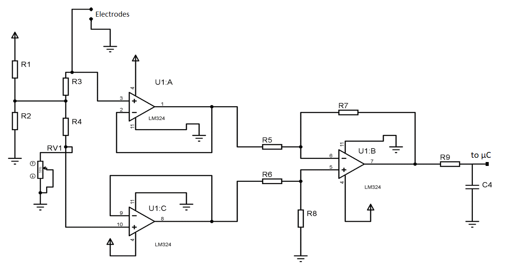

# GSR Sensor Design

The complete circuit for Galvanic Skin Response Sensor consists of four stages :

1. Wheatstone Bridge 
2. Unity Buffer 
3. Differential Amplifier 
4. Low Pass Filter

| S.No | Item   | Value |
|------|--------|-------|
| 1    | R3, R4 | 10k   |
| 2    | RV1    | 50k   |
| 3    | R7, R8 | 1.3M  |
| 4    | R5, R6 | 100k  |

## Galvanic Skin Response (GSR) Sensor Design

This section explains the design and functioning of the GSR sensor circuit, which measures the electrical conductance of the skin. The conductance varies with the moisture level and is used to assess physiological arousal.

### Circuit Diagram

### Components

- **R1, R2, R3, R4, R5, R6, R7, R8, R9**: Resistors with appropriate values for the circuit.
- **RV1**: Variable resistor/potentiometer for calibration.
- **U1:A, U1:B, U1:C**: LM324 operational amplifiers used for signal amplification and processing.
- **C4**: Capacitor for filtering.
- **Electrodes**: Connected to the skin to measure conductance.

### Working Principle

1. **Electrode Placement**: Electrodes are placed on the skin to measure the electrical conductance.
2. **Signal Conditioning**: The conductance signal from the electrodes is conditioned using the operational amplifiers (U1:A, U1:B, U1:C). The signal is amplified and filtered to obtain a stable reading.
3. **Data Processing**: The processed signal is then sent to a microcontroller (µC) for further analysis and data logging.

### How to Use

1. **Calibration**: Adjust RV1 to calibrate the sensor for accurate readings.
2. **Electrode Placement**: Place the electrodes on the skin.
3. **Power Up**: Power the circuit and observe the output signal on the microcontroller.
4. **Data Logging**: Use the microcontroller to log the data for analysis.

This GSR sensor circuit can be integrated with the serial to Firebase data logger for real-time monitoring and analysis of physiological data.

## License

This project is licensed under the MIT License.
